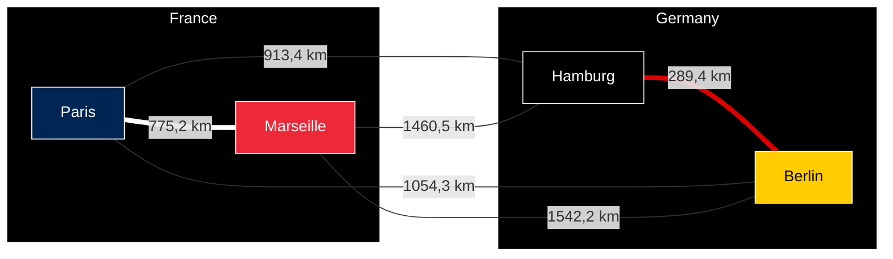

# travelling-salesman-problem-website

This is the source code for the website of the travelling salesman problem.

It is a port of the [travelling salesman problem](https://github.com/clementreiffers/travelling-salesman-problem) to a website.

## 🚀🚀[you can try the website online by clicking here](https://clementreiffers.github.io/travelling-salesman-problem-website) 🚀🚀

> **Note**  
> This project is a work in progress, it is not finished yet.

## Description

The Travelling Salesman Problem also known as TSP is an NP-hard problem in combinatorial optimization.  
Imagine a set of city disposed on a map, you have a set of salesman (population) and they must all
go to every city in the least amount of time/distance.  
The optimization solution is the one where a salesman goes through all the cities with the least
distance or/and time.

In the schema below you can see an example with some cities in Europe (Paris, Marseille, Berlin, Hamburg).
Going from a city to another take more or less time than other depending on the distance.

The Travelling Salesman Problem can find the most optimized path to join all cities.

> **WARNING**
> This code below shows how it works, it will be well printed by seeing this
> [GitHub Repository](https://github.com/clementreiffers/travelling-salesman-problem)

### App description/implementation

To implement the travelling salesman problem we use genetic algorithm.

Step order:

1. Generate a population where every salesman (individual) has a list of city he goes through.

2. Mutate the population (20% chance of happening on every individual).

3. Crossover the population to create 40% of new individuals that will replace 40% of the old one. An offspring inherits
   all cities from its first parent and a chance of 20% to inherits a city from its second parent.

4. Repair all individuals which pass through a city more than one time.

5. Calculate the score of all individuals. The score is calculated by the addition of all values of all cities.
   All individuals have a different score because the calculation is limited by a max distance. If the max distance is
   greater than the sum of all cities, all individuals would have the same score.

6. Show the best score among all the population.

7. Reiterates all the previous steps N times with the new mutated population.

## Links

### Documentations

- [What is Travelling Salesman Problem?](https://en.wikipedia.org/wiki/travelling_salesman_problem/)
- [Understand what is a genetic algorithm](https://www.youtube.com/watch?v=ncj_hBfRt-Y>)

### Libraries

- [Node and npm (runtime environment and software packaging system)](https://nodejs.org/)
- [Yarn (software packaging system)](https://classic.yarnpkg.com/lang/en)
- [Ramda (functional programming library in JS)](https://ramdajs.com)
- [Gulp (auto script starter)](https://gulpjs.com)
- [Chai (assertion library)](https://www.chaijs.com/)
- [Mocha (test framework)](https://mochajs.org)
- [Xo (code formater wraper)](https://github.com/xojs/xo)
- [Prettier (code formatter)](https://prettier.io)
- [Editor config (normalize the IDE for the project)](https://EditorConfig.org)
- [Mermaid (Graph shown in Readme)](https://mermaid.js.org)

### Other

- [GitHub Badges](https://github.com/aleen42/badges)

